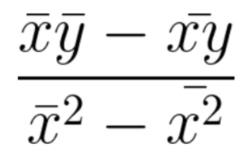

# Machine Learning Implementations
Here are some of my implementations of some commonly used machine learning algorithms in C++, python, and typescript.

---

## Table of contents

- [Linear Regression](#linear-regression)

---

### `Linear Regression`

[](./src/LinearRegression/LinearRegression.cpp)

This is an implementation of simple Linear Regression in C++.

**Formula**




**C++ implementation**
```cpp
template <class T>
pair<float, float> linearRegression(vector<T>& xs, vector<T>& ys);
```

```cpp
vector<int> xs = {1,2,3,4,5};
vector<int> ys = {1,2,3,4,5};

pair<float, float> equation = linearRegression(xs, ys);
```

```
equation.first  = 1
equation.second = 0
```